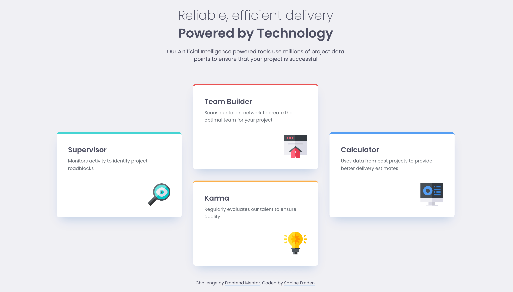

# Frontend Mentor - Four card feature section solution

This is a solution to the [Four card feature section challenge on Frontend Mentor](https://www.frontendmentor.io/challenges/four-card-feature-section-weK1eFYK). Frontend Mentor challenges help me improve my coding skills by building realistic projects.

## Table of contents

- [Overview](#overview)
  - [The challenge](#the-challenge)
  - [Screenshot](#screenshot)
  - [Links](#links)
- [My process](#my-process)
  - [Built with](#built-with)
  - [What I learned](#what-i-learned)
  - [Continued development](#continued-development)
  - [Useful resources](#useful-resources)
- [Author](#author)
- [Acknowledgments](#acknowledgments)

## Overview

### The challenge

The brief for this challenge was to build out the feature section and get it looking as close to the design as possible, starting with the following assets:

- Figma design file access
- JPEG design files for mobile & desktop layouts
- Style guide for fonts, colors, etc.
- Optimized image assets
- HTML file with pre-written content

Users should be able to:

- View the optimal layout for the site depending on their device's screen size

### Screenshot

### Links

- [Frontend Mentor solution](https://www.frontendmentor.io/solutions/four-card-feature-section-using-ccs-grid-JA4Lrjarnv)
- [Live site](https://sabineemden.github.io/fm-four-card-feature-section/)

## My process

### Built with

- Semantic HTML5 markup
- CSS custom properties
- Flexbox
- CSS Grid
- Mobile-first workflow

### What I learned

I completed this challenge as part of the Frontend Mentor learning path [Building responsive layouts](https://www.frontendmentor.io/learning-paths/building-responsive-layouts--z1qCXVqkD). It is the second of four challenges on the learning path and focuses on building flexible layouts with CSS Grid.

The four cards are laid out in a single column on mobile view. The layout switches to a narrow diamond pattern on tablet view and a wide diamond on desktop view. On tablet and desktop, the cards are laid out in two dimensions in a layout-first design. This makes the design a great fit for CSS Grid.

### Continued development

Building layouts that are flexible and work well across all screen sizes is a fundamental skill in front-end web development. I will be able to use and refine this skill in future web development projects.

### Useful resources

- [An Interactive Guide to CSS Grid](https://www.joshwcomeau.com/css/interactive-guide-to-grid/) by Josh Comeau - This great article helped me to refresh my knowledge of CSS Grid.
- [Grid template areas](https://developer.mozilla.org/en-US/docs/Web/CSS/Guides/Grid_layout/Grid_template_areas) on MDN - This article gives an in-depth explanation of using named template areas for positioning items on a grid layout.
- [CSS Grid Layout Guide](https://css-tricks.com/complete-guide-css-grid-layout/) by Geoff Graham for CSS-Tricks - This guide is an excellent reference for all things CSS Grid.

## Author

I'm an aspiring web developer and a former chemist. What I bring from chemistry to software development is a systematic approach to problem solving and the perseverance to not give up easily.

- Frontend Mentor - [@SabineEmden](https://www.frontendmentor.io/profile/SabineEmden)
- Personal Website - [Sabine Emden](https://www.sabineemden.com/)
- Mastodon - [@sabineemden](https://social.tchncs.de/@sabineemden)

## Acknowledgments

This solution uses Josh Comeau's [CSS reset](https://www.joshwcomeau.com/css/custom-css-reset/).

The font family used in this project is [Poppins](https://fonts.google.com/specimen/Poppins). The fonts are licensed under the [Open Font License](https://openfontlicense.org/).
